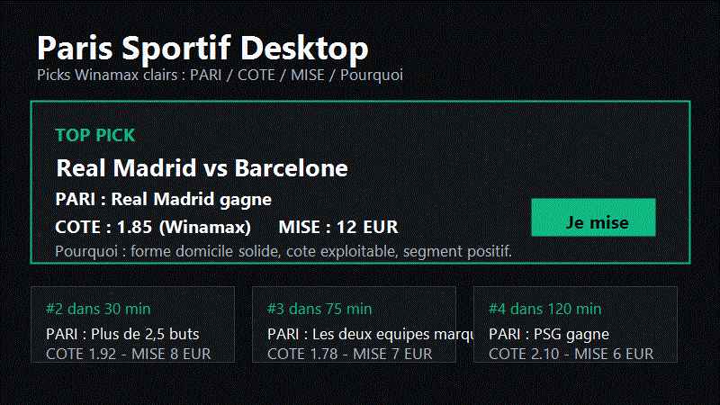

# Paris Sportif Desktop



Paris Sportif Desktop est le logiciel PC local pour préparer tes paris Winamax. Il lit les données locales, calcule les picks, affiche les paris simples les plus clairs et garde ton suivi bankroll sur ta machine.

## Installation

### Version installateur Windows

La version v4.1.6 se génère avec :

```powershell
npm --prefix desktop run dist
```

Le fichier attendu est `Paris Sportif Desktop Setup 4.1.6.exe`. Le build packagé embarque les données, rapports modèle et scripts nécessaires au démarrage. Python reste recommandé si tu veux relancer une pipeline complète depuis la machine installée.

### Version développeur

1. Installe Node.js et Python si ce n'est pas déjà fait.
2. Depuis le dossier du projet, lance `npm --prefix desktop install`.
3. Lance le logiciel avec `npm --prefix desktop start`.

Sur Windows, le fichier `LANCER-LOGICIEL.bat` peut aussi ouvrir l'application directement depuis la racine du projet.

## Premier Lancement

Au premier démarrage, configure :

- ta bankroll de départ ;
- les sports que tu veux suivre ;
- ton niveau de prudence ;
- le mode démo si tu veux tester sans toucher à ton vrai suivi.

Le mode standard reste volontairement simple : `Picks`, `Bilan`, `Réglages`. Les diagnostics techniques sont cachés dans `Avancé` quand le Mode expert est activé.

## Utilisation Quotidienne

Ouvre l'app et lis d'abord le haut de la vue `Picks`.

- `Bet ultime du jour` : le meilleur ticket simple si un pick assez solide existe.
- Organisation au choix : `Horaire`, `Type` ou `Sport`, avec les sections vides masquées.
- Chaque carte affiche `PARI`, `COTE`, `MISE` et `Pourquoi`.
- Clique `Je mise` pour suivre le pari localement.
- Clique `Ouvrir Winamax` pour aller sur la page du match.
- Ajoute tes équipes ou joueurs favoris dans `Réglages > Favoris` pour ne pas rater leurs picks, même quand ils ne sont pas dans le top du jour.

Si le modèle trouve trop peu de paris simples aujourd'hui alors que Winamax propose beaucoup de matchs, l'app affiche `Modèle trop strict aujourd'hui` avec le funnel complet. C'est volontaire : elle préfère dire clairement qu'elle manque de signaux fiables plutôt que de remplir l'écran avec des paris faibles ou des marchés complexes.

Depuis v1.5.0, certains matchs avec peu de contexte secondaire peuvent apparaître en `Confiance limitée`. Ils augmentent la couverture du jour, mais restent non actionnables tant qu'ils n'ont pas de mise claire.

L'app ne place pas de pari automatiquement. Elle prépare le ticket et suit ton résultat.

En Mode expert, l'auto-tracking supervisé peut suivre automatiquement certains tickets dans l'app selon tes règles. C'est uniquement un suivi interne : tu dois toujours ouvrir Winamax et confirmer toi-même le pari réel.

## Nouveautés v4.1.6

La v4.1.6 prend en compte les rivalités d’équipes :

- la pipeline cherche les derbys/rivalités publiques avec validation stricte des deux équipes et rejet des pages génériques ;
- les fiches affichent une carte `Rivalité / derby` quand la source est confirmée ;
- le modèle réduit prudemment la confiance et la mise sur les Vainqueurs trop marginaux dans un match à forte tension ;
- les raisons de pick et la checklist de fiche affichent la rivalité comme signal lisible avant de miser ;
- la sécurité d’image autorise les logos ESPN publics déjà présents dans le snapshot, sans ouvrir de source de cote externe.

## Nouveautés v4.1.5

La v4.1.5 ajoute une vraie couche de signaux web sourcés :

- la pipeline interroge des sources publiques avec cache et rate-limit, puis conserve la provenance dans `public_match_signals.json` ;
- les fiches affichent un bloc `Signaux web vérifiés` avec profils publics, coach confirmé quand disponible, signaux tactiques prudents et liens de source ;
- si Wikidata/Wikipedia limitent les requêtes, l'app bascule proprement sur le profil public ESPN déjà présent dans le snapshot, sans inventer de donnée ;
- les signaux web enrichissent le contexte uniquement : les cotes et décisions actionnables restent 100% Winamax ;
- la source `public_web` apparaît dans le registre des sources pour être rafraîchie depuis la pipeline terrain.

## Nouveautés v4.1.4

La v4.1.4 enrichit les fiches match avec plus de visuel et une lecture tactique plus claire :

- photos joueurs chargées et mises en cache pour les compositions, les joueurs clés, le tennis et les profils sports US quand une source fiable existe ;
- recherche coach via Wikidata côté app, puis photo entraîneur mise en cache quand une source fiable confirme le nom ;
- nouvelle section `Entraîneurs & tactique` : système, style de jeu et lecture concrète du plan de match ;
- les duels tactiques affichent maintenant les deux joueurs avec photo ou initiales propres ;
- le terrain conserve une photo même en ligne compacte, au lieu de supprimer le visage des titulaires.

## Nouveautés v4.1.3

La v4.1.3 rend la forme récente beaucoup plus lisible :

- les codes bruts `WWDND`, `VDVVV` ou `DDDDD` ne sont plus affichés tels quels ;
- la fiche traduit la dynamique en français clair : `3 victoires, 1 nul, 1 défaite` ;
- les zones visuelles utilisent des pastilles `V Victoire`, `N Nul`, `D Défaite` ;
- les libellés des blocs équipe ne collent plus aux valeurs.

## Nouveautés v4.1.2

La v4.1.2 nettoie le terrain de composition dans les fiches match foot :

- plus de terrain construit avec des “joueurs stars” quand la vraie compo n’est pas publiée ;
- affichage du terrain uniquement si la compo confirmée ou probable contient assez de titulaires ;
- joueurs alignés en grille par ligne, sans débordement ni noms qui cassent la fiche ;
- message propre quand la source compo est absente ou trop partielle.

## Nouveautés v4.1.1

La v4.1.1 corrige la pile opérationnelle qui pouvait rester en retard sur les données fraîches :

- les rapports `V8 → V16` sont maintenant recalculés à chaque refresh terrain, avant les exports et la santé globale ;
- les matchs déjà commencés ou expirés ne peuvent plus ressortir en `À jouer`, `À finaliser T-10` ou `prix à surveiller` ;
- les rapports avancés distinguent enfin les vrais candidats actuels des vieux signaux à écarter ;
- les tests moteur échouent si un match expiré revient dans le ticket actif.

## Nouveautés v4.1.0

La v4.1.0 répare le contexte par sport au lieu de pénaliser tous les matchs avec les mêmes sources :

- les matchs tennis ne sont plus bloqués par des sources football inutiles comme compositions, arbitres, météo ou xG ;
- la pipeline lance désormais le fetch Sackmann + patch tennis dans les refresh rapides, pré-match et réparations source ciblées ;
- les rapports de contexte distinguent les signaux `tennis_features` et `sport_stats`, avec des priorités de réparation plus justes ;
- le bug Windows du fetch tennis lié aux caractères non ASCII dans la console est corrigé ;
- les tests terrain vérifient qu’un dossier tennis ne retombe plus dans les faux blocages football-only.

## Nouveautés v4.0.0

La v4.0.0 lance le chantier `Pronostics Winamax Pro, Plus Nombreux, Plus Fiables, Plus Lisibles` sans gonfler artificiellement les boutons `Je mise` :

- chaque ligne cockpit porte maintenant `PickDecision v6` : readiness de pari, signaux critiques manquants, plan de réparation source, traces quotas marché/sport/ligue, trace du filet Winamax 2-0 et raison de déblocage nuit ;
- chaque fiche expose `MatchSheet v6` : template par sport, complétude de section, liens/preuves de donnée, fraîcheur, disponibilité joueurs et détail de confiance ;
- la santé sources passe en `SourceHealth v8`, qui sépare l’état technique de la vraie couverture métier, compte les prêts bloqués par source et garde le dernier snapshot sain ;
- le terrain passe en `TerrainReport v5` : volume, nuit, variété, bugs visibles, sections vides, captures attendues, latence et prochaines réparations actionnables ;
- le laboratoire modèle expose `ModelBacktest v6`, avec lecture par sport, marché, ligue, heure, qualité source, statut de décision et règle Winamax 2-0 ;
- l’interface privilégie automatiquement ces contrats v6/v8/v5 pour expliquer pourquoi une ligne est prête, observable ou bloquée par un dossier match faible.

## Nouveautés v3.2.0

La v3.2.0 pousse le plan `Pronostics Plus Fiables, Plus Nombreux, Plus Propres` avec des diagnostics terrain encore plus précis :

- chaque ligne cockpit porte maintenant `PickDecision v5` : score modèle, score pari rapide, blocages de sources, statut quota/nuit, politique de mise, éléments manquants pour miser et phrase utilisateur ;
- chaque fiche expose `MatchSheet v5` : sections obligatoires/facultatives, qualité par section, preuves affichées, état de relance enrichissement et manques critiques ;
- la santé sources passe en `SourceHealth v7`, avec couverture actuelle/cible, delta à réparer, auto-réparation autorisée, politique de retry et gain estimé en picks ;
- le terrain passe en `TerrainReport v4` : résumé pari rapide, résumé nuit, bugs visibles, sections vides et prochaines réparations actionnables ;
- le laboratoire modèle expose `ModelBacktest v5`, avec lecture par qualité source, statut de décision et règles Winamax pour éviter de promouvoir artificiellement des picks faibles.

## Nouveautés v3.1.0

La v3.1.0 durcit le chantier `Pronostics Pro Winamax` sur les points qui bloquent vraiment les paris :

- chaque pick expose maintenant `PickDecision v4` : statut, mise, avantage, famille de marché, raisons de blocage, qualité source, règle Winamax 2-0 et texte court/long ;
- chaque fiche expose `MatchSheet v4` : sections visibles, sections cachées parce que vides, données critiques manquantes, confiance compos/joueurs/contexte et couverture source ;
- la santé sources passe en `SourceHealth v6`, avec sources dégradées, snapshots préservés, priorités de réparation et gain estimé en picks ;
- le terrain passe en `TerrainReport v3` : résumé “pari vite”, prêts, nuit, distribution marché/sport, checks UX et goulets d’étranglement ;
- le laboratoire modèle expose `ModelBacktest v4` pour comparer sport, marché, ligue, tranche horaire et qualité source.

## Nouveautés v3.0.0

La v3.0.0 pose le socle `Pronostics Pro Winamax` :

- chaque pick expose une décision v3 claire : prêt ou observation, mise, raison, risque, qualité source et règles Winamax ;
- chaque fiche match expose un dossier v3 : compos, joueurs, forme, H2H, absences, arbitre, météo, sources et données manquantes sans faux zéro ;
- les sources ont une santé v5 lisible, avec snapshots préservés et blocages éventuels ;
- l'audit marchés v2 distingue familles disponibles, exploitées, standard, expert et dormantes ;
- le rapport terrain v2 mesure vraiment volume, nuit, prêts, à surveiller et goulets d'étranglement.

## Nouveautés v2.1.0

La v2.1.0 répond aux retours terrain sur la lisibilité et la variété :

- brief audio retiré : l'app reste en brief texte, sans lecture vocale ;
- règle Winamax 2-0 prise en compte sur les Vainqueurs foot éligibles, avec badge `sécurité 2-0` et détail dans la fiche ;
- cockpit rééquilibré vers plus de paris `Vainqueur du match`, moins de domination Plus/Moins ;
- vues `Horaire`, `Type` et `Sport` pour décharger l'accueil ;
- fiches nettoyées : pas de faux xG à 0, chips vides cachées et compositions foot affichées sur un terrain par lignes de formation.

## Nouveautés v2.0.1

La v2.0.1 consolide la release majeure v2.0 :

- validation terrain des 7 modules Ultra, pas seulement des tests automatisés ;
- cockpit nuit renforcé : les matchs 0h-6h Paris remontent mieux, avec une séparation nette entre `pari prêt` et `à surveiller` ;
- dashboard custom réellement déplaçable par glisser-déposer, avec ordre mémorisé par preset ;
- scanner inter-matchs avec accès direct aux combinés ;
- corrections des erreurs runtime qui pouvaient bloquer le brief du matin ou l'ouverture d'une fiche match ;
- scripts de QA isolés pour ne plus être bloqués par une instance utilisateur déjà ouverte.

## Nouveautés v2.0

La v2.0 garde le mode standard simple, mais ajoute une couche Ultra en Mode expert :

- cockpit jusqu'à 25 lignes avec rotation sport/marché/ligue pour éviter un écran rempli du même type de pari ;
- logos/avatars locaux dans les cartes et image hero sur le top pick ;
- calibration plus stricte des probabilités hautes pour éviter les picks trop sûrs sur le papier ;
- `Simulation Monte Carlo` dans la fiche match : 10 000 scénarios locaux pour visualiser la probabilité de gain et le risque ;
- `Modèle personnel` : score de cohérence avec ton style gagnant si ton historique contient assez de paris réglés, sinon fallback explicite ;
- `Scanner du jour` : patterns inter-matchs, repliés par défaut ;
- `Dashboard custom` en Mode expert avec presets Matin / Soir / Live, glisser-déposer et reset ;
- watcher Twitter/X public optionnel côté main process, avec cache et rate limit ;
- `Ajustements 24h` : les segments sont durcis ou assouplis prudemment selon le backtest et ton historique local.

Pour utiliser ces modules, active `Mode expert` dans `Réglages > Avancé`. Le mode standard reste volontairement aéré.

Les objectifs de volume restent soumis aux données réelles Winamax du jour. Si la nuit ou un sport manque de matchs exploitables, l'app le dit au lieu de fabriquer des recommandations faibles.

## Nouveautés v1.7

Les fiches match sont devenues le centre de décision :

- texte narratif rassurant en 4 à 6 phrases, avec les chiffres disponibles ;
- foot : compositions, joueurs clés, xG/xA, tirs cadrés, dribbles, conversion, forme, coach, arbitre, météo, H2H et duels tactiques ;
- tennis : surface, forme, H2H, aces, premier service, break points et bilan par surface quand les sources les exposent ;
- autres sports : starters probables, stats équipe/joueur utiles, forme récente et contexte live selon le sport ;
- `News watcher temps réel` : vérifie les sources publiques proches du coup d'envoi, classe blessure/compo/suspension/météo/coach, puis demande un re-check si nécessaire ;
- aucun `Match nul` en mode standard : ce marché reste réservé au Mode expert.

Pour lire une fiche enrichie : ouvre une carte, lis d'abord `PARI / COTE / MISE`, puis `Pourquoi ce pari`, puis les `Joueurs clés` et `Analyse tactique`. Les sources indisponibles sont affichées franchement au lieu d'être inventées.

## Winamax

Le logiciel est 100% Winamax :

- seules les cotes Winamax sont utilisées pour les tickets actionnables ;
- les marchés complexes sont masqués par défaut ;
- les liens ouvrent les pages Winamax quand elles sont disponibles ;
- les promos/boosts Winamax sont affichés discrètement quand les données les détectent.

## Bilan Et Bankroll

La vue `Bilan` montre :

- P&L total, P&L du jour et ROI ;
- paris suivis, notes, tags et export CSV ;
- comparaison `Si tu avais suivi le modèle` ;
- simulation 30 jours ;
- décomposition profonde : sport, ligue, marché, jour, horaire, taille de mise, cote et avantage ;
- insights actionnables pour comprendre où tu gagnes et où tu perds ;
- comptabilité dépôts/retraits ;
- patterns personnels et apprentissages.
- réconciliation Winamax : colle tes paris depuis `Mes paris`, l'app compare ce qui est suivi localement et ce qui manque.
- stratégies sauvegardées : ROI, WR et P&L par sélection de filtres que tu as mémorisée.

Les données sont stockées localement. Utilise `Réglages > Profil local` pour exporter ou importer ton profil.

## IA Optionnelle

L'IA moteur est optionnelle. Si tu ajoutes une clé API dans `Réglages > IA`, elle peut aider à rédiger les explications et détecter les anomalies. Sans clé, l'app garde un fallback heuristique complet.

L'IA ne remplace jamais les garde-fous du modèle et ne modifie pas ta bankroll.

## Recherche

La vue `Recherche` permet de fouiller la base locale avant de miser :

- cherche une équipe, un joueur ou une ligue ;
- ouvre une fiche avec prochains matchs Winamax, forme, blessures locales et ROI historique ;
- compare deux équipes ou ligues côte à côte.

Tout reste local et Winamax-only : aucune cote d'autre bookmaker n'est utilisée.

## Stratégies Et Réconciliation

Dans `Picks`, le bouton `Sauver cette sélection` mémorise les filtres actifs comme une stratégie. Tu peux ensuite la réappliquer depuis le menu `Mes stratégies`, puis suivre sa performance dans `Bilan`.

Dans `Réglages > Bankroll`, `Importer paris Winamax` accepte un copier-coller de la page `Mes paris`. L'app extrait date, match, marché, cote, mise et statut, puis indique :

- `Suivi dans l'app` si le pari correspond déjà ;
- `Non suivi` si Winamax contient un pari absent de l'app ;
- `Montant différent` si la mise locale ne correspond pas.

Ces données restent locales et servent seulement à aligner ton bilan réel avec le suivi de l'app.

## Auto-tracking Supervisé

L'auto-tracking est caché dans `Réglages > Avancé` et demande une confirmation explicite.

- `Dry-run` simule les règles sans créer de pari suivi.
- Les règles couvrent niveau de pick, edge minimum, cote min/max, sports, marchés, budget journalier, limite de paris et horaires.
- Le bouton `Stopper l'auto-tracking` coupe tout immédiatement pour la journée.
- Quand un ticket est auto-tracké, tu reçois une notification et tu peux ouvrir Winamax pour confirmer manuellement.

Ce mode ne parie jamais à ta place.

## Langue

Dans `Réglages > Apparence`, tu peux choisir Français, English ou Auto. La couche FR/EN couvre les surfaces critiques de navigation, recherche, stratégies et réglages ; les rapports historiques restent lisibles dans leur langue d'origine.

## Mode Trading Desk

Dans `Réglages > Avancé`, active `Mode expert`, puis `Mode Trading Desk`.

Ce mode ajoute une vue dense pour power users : top picks, live, bankroll et alertes du moment. Les raccourcis utiles sont :

- `J` : miser le top pick ;
- `N` / `P` : pick suivant / précédent ;
- `F` : ajouter le pick courant aux favoris ;
- `C` : ouvrir le cash-out Winamax du live courant ;
- `Espace` : refresh.

Le mode standard reste inchangé si tu ne l'actives pas.

## Alertes

Tu peux activer :

- alertes PC pour les picks importants ;
- webhook mobile générique, Discord, ntfy.sh, Telegram ou Pushover ;
- brief du soir ;
- anti-tilt strict ;
- stop-loss et take-profit.

## Mode Démo

Active `Mode démo` dans `Réglages`, puis clique `Faire le tour démo`. Le logiciel crée un suivi virtuel séparé de tes vrais paris pour apprendre l'app sans risque.

## Sauvegarde Et Restauration

Dans `Réglages > Profil local` :

- `Exporter mon profil` sauvegarde bankroll, paris, notes, tags, préférences et rapports locaux ;
- `Importer un profil` permet de fusionner ou remplacer ;
- des backups automatiques sont gardés dans `desktop/state/backups/`.

## Refresh Et Données Anciennes

L'app se rafraîchit en arrière-plan. Si les données sont anciennes ou qu'un refresh échoue, elle garde les dernières données valides et affiche un bandeau clair.

En Mode expert, la vue `Avancé` montre la pipeline, les logs et les diagnostics.

Le diagnostic Winamax détaillé se lance aussi avec :

```powershell
npm --prefix desktop run qa:winamax-audit
```

Il indique les sports disponibles, familles de marchés exploitées, marchés dormants, boosts/promos détectés et conversion du jour.

## Modèle Et Tendances

Le Mode expert affiche l'audit réalité modèle sur 60 jours :

- segments gagnants persistants ;
- segments froids à durcir ;
- Brier par sport/marché ;
- calibration par tier ;
- drift saisonnier ;
- ajustements actifs et bouton de réinitialisation.

Dans la vue standard, seuls les signaux utiles apparaissent : `Tendance forte` ou `Tendance froide` quand un segment récent mérite vraiment ton attention.

## Dépannage

- Aucun pick visible : vérifie la fraîcheur des données et lance un refresh depuis `Avancé`.
- Winamax ne s'ouvre pas : certains événements peuvent manquer de lien direct, ouvre le match manuellement sur Winamax.
- Profil corrompu : importe un export récent ou restaure depuis `desktop/state/backups/`.
- Notifications absentes : vérifie les permissions Windows et le webhook dans `Réglages`.
- L'app ne démarre pas : relance une seule instance, puis regarde `Réglages > Avancé > Logs`.
- Un bug revient : `Réglages > Avancé > Signaler un bug` sauvegarde un rapport anonymisé.

## Build Windows

Pour générer un installateur Windows :

```powershell
npm --prefix desktop run dist
```

La sortie est écrite dans `desktop/dist/`. Le build embarque l'application Electron, les scripts locaux et les derniers fichiers de données disponibles. Python doit être disponible sur la machine si tu veux relancer la pipeline locale complète.

Un guide utilisateur plus complet est disponible dans `desktop/docs/user-guide.md`.

Si un ancien dossier `desktop/dist/` est verrouillé par Windows, tu peux valider un build équivalent avec une sortie temporaire :

```powershell
cd desktop
npx electron-builder --win nsis --x64 --config.directories.output=dist-temp
```

## FAQ

1. **Est-ce que l'app mise automatiquement ?** Non. Elle prépare le ticket, tu confirmes sur Winamax.
2. **Pourquoi seulement Winamax ?** Pour garder les cotes, liens, boosts et tickets cohérents avec ton usage réel.
3. **Pourquoi je ne vois pas les handicaps ?** Les marchés complexes sont cachés par défaut. Active le Mode expert si tu veux les revoir.
4. **Que signifie `PARI` ?** C'est exactement ce que tu dois sélectionner chez Winamax.
5. **Que signifie `COTE` ?** C'est la cote Winamax utilisée par le modèle au moment du calcul.
6. **Que signifie `MISE` ?** C'est une suggestion prudente selon ta bankroll et tes limites.
7. **Puis-je changer ma bankroll ?** Oui, dans `Réglages > Profil`.
8. **Comment suivre un pari ?** Clique `Je mise`, puis place le pari chez Winamax.
9. **Comment régler un pari terminé ?** L'app tente le settlement automatique ; le manuel reste disponible en secours.
10. **Pourquoi un pari reste pending ?** Il manque souvent un résultat final confirmé ou la marge de sécurité post-match.
11. **Pourquoi les données peuvent être anciennes ?** La pipeline locale ou GitHub peut avoir échoué ; l'app garde le dernier snapshot valide.
12. **Que faire si les données sont anciennes ?** Lance un refresh depuis la vue standard ou `Avancé` si le Mode expert est actif.
13. **L'IA est-elle obligatoire ?** Non. Sans clé, l'app utilise ses règles locales.
14. **Où est stockée ma clé IA ?** Localement, dans ton profil Electron.
15. **Qu'est-ce que le Mode expert ?** Les diagnostics, logs, pipeline, marchés avancés et raccourcis.
16. **Comment activer le thème clair ?** `Réglages > Apparence > Thème`.
17. **Comment recevoir les versions beta ?** `Réglages > Avancé > Canal > Beta`.
18. **Comment envoyer un bug ?** `Réglages > Avancé > Signaler un bug`.
19. **Que contient un rapport de bug ?** Version, OS, erreurs et état anonymisé. Pas de clé API ni montant détaillé.
20. **Comment sauvegarder mon profil ?** `Réglages > Profil local > Exporter mon profil`.
21. **Comment restaurer mon profil ?** `Importer un profil`, puis fusionner ou remplacer.
22. **Comment tester sans risque ?** Active `Mode démo`, puis lance le tour rapide.
23. **Pourquoi je reçois une alerte anti-tilt ?** Tu dépasses tes limites de rythme, perte ou mise.
24. **Pourquoi un pick disparaît après refresh ?** La cote, la donnée ou le garde-fou a changé.
25. **Quelle routine suivre le premier mois ?** Lis le guide `docs/first-month.md`.
26. **L'auto-tracking mise-t-il réellement ?** Non. Il crée seulement un suivi interne et t'invite à confirmer chez Winamax.
27. **Comment réconcilier Winamax ?** Colle tes lignes `Mes paris` dans `Réglages > Bankroll > Importer paris Winamax`.
28. **À quoi servent les stratégies ?** À rejouer un ensemble de filtres et suivre son ROI séparément.
29. **Puis-je passer l'app en anglais ?** Oui, dans `Réglages > Apparence > Langue`.
30. **C'est quoi xG ?** `Expected Goals` : une estimation de la qualité des occasions, plus utile qu'un simple total de tirs.
31. **Comment lire l'analyse tactique ?** Regarde les duels clés : si le pari dépend d'un couloir, d'un buteur ou d'un rythme de match, la fiche te dit quel matchup le soutient.
32. **Pourquoi pas de match nul ?** Tu as indiqué ne pas vouloir le jouer. L'app le masque en mode standard pour garder les picks simples.
33. **Comment activer le news watcher ?** Il tourne automatiquement sur les picks proches. En Mode expert, la Pipeline montre les sources vérifiées, différées ou à relancer.
34. **Que faire si Sofascore ou une source répond 403 ?** L'app garde les données locales, marque la source à relancer et ne déclasse pas un pick sans confirmation négative.
35. **Comment lire une fiche enrichie ?** Commence par le ticket, puis le texte narratif, puis les joueurs clés, la tactique et les sources. Les détails techniques restent sous les sections avancées.
36. **C'est quoi Monte Carlo ?** Une simulation locale de 10 000 scénarios du match pour visualiser si le pari gagne souvent, rarement ou dans des scénarios très serrés.
37. **Comment fonctionne le modèle personnel ?** Il compare les picks à tes paris réglés. Avant 50 paris, il affiche un fallback prudent et indique que le sample est insuffisant.
38. **Twitter/X watcher sert à quoi ?** Il surveille des sources publiques et sociales pour repérer blessure, compo, suspension ou news tardive avant le match.
39. **Pourquoi le brief reste en texte ?** Le brief reste lisible et discret : pas de lecture vocale, pas de bouton supplémentaire.
40. **Pourquoi une ligne de nuit peut être `À surveiller` ?** L'app préfère te montrer le match nocturne important sans bouton de mise plutôt que forcer un pari quand les signaux ne sont pas assez robustes.
